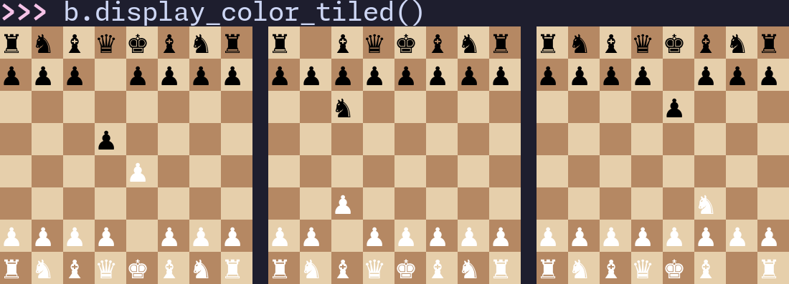

# rust-chess



`rust-chess` is a Python package that acts as a bridge between the `chess` crate and Python. It aims to provide a high-performance chess library that is largely compatible with `python-chess` syntax.

This repository provides:

- A Python package `rust-chess` created using Maturin.
- A type stub (`rust_chess.pyi`) providing hover documentation and examples in IDEs.
- A benchmark comparison against `python-chess` with `tests/benchmark.py` and `tests/batchmark.py`.

## WARNING

This project is almost out of alpha/beta phase (pun intended). Maybe expect some breaking changes, refactoring, and new features.

## Overview

Quick usage example:

```python
import rust_chess as rc

board = rc.Board()  # Create a board
move = rc.Move.from_uci("e2e4")  # Create move from UCI

# Check if the move is legal for the current board
if board.is_legal_move(move):
    # Make a move on the current board
    # Disable the legality check since we already know the move is legal
    board.make_move(move, check_legality=False)

# Make move onto a new board
new_board = board.make_move_new(rc.Move("e7e5"))

# Get the FEN of the current board
print(board.get_fen())

# Generate the next move
move = board.generate_next_move()

# Create a list of all legal moves (exhausts the generator)
moves = list(board.generate_legal_moves())

# The generator saves state
assert move not in moves

# Reset the generator to be able to generate moves again
board.reset_move_generator()

# Generate legal captures
captures = list(board.generate_legal_captures())
```

Use IDE completion or read the generated stub (`rust_chess.pyi`) for detailed function signatures and documentation. Actual documentation coming soon (TM).

## Features

### Data Types and Constants

- `Color`: `WHITE`, `BLACK`, `COLORS`
- `PieceType`: `PAWN`, `KNIGHT`, `BISHOP`, `ROOK`, `QUEEN`, `KING`, `PIECE_TYPES`
- `Piece`: `WHITE_PAWN` ... `BLACK_KING`, `COLORED_PIECES`
- `Square`: `A1` ... `H8`, `SQUARES`
- `Bitboard`: `BB_EMPTY`, `BB_FULL`, `BB_FILE_A` ... `BB_FILE_H`, `BB_RANK_1` ... `BB_RANK_8`, `BB_FILES`, `BB_RANKS`
- `Move`: `WHITE_QUEENSIDE_CASTLE`, `WHITE_KINGSIDE_CASTLE`, `BLACK_QUEENSIDE_CASTLE`, `BLACK_KINGSIDE_CASTLE`
- `PyRepetitionDetectionMode` enum: `.NONE`, `.PARTIAL`, `.FULL`
  - Currently no difference between partial and full for now, but the plan is to have partial have a smaller history list
- `CastleRights` enum: `.NO_RIGHTS`, `.QUEENSIDE`, `.KINGSIDE`, `.BOTH`
- `BoardStatus` enum: `.ONGOING`, `.FIVE_FOLD_REPETITION`, `.SEVENTY_FIVE_MOVES`, `.INSUFFICIENT_MATERIAL`, `.STALEMATE`, `.CHECKMATE`
- `Board`: No constants.
- `BoardBatch`: No constants.

### Basic Features Overview

- Create a `Board` from an optional FEN string with `board = rc.Board()`.
- Get the FEN of a board by calling `get_fen()` on a board object.
- Iterate over every square using the `rc.SQUARES` constant or get an individual square by using the corresponding constant (ex. `rc.E2`).
- Create a `Bitboard` from an integer or square.
  - Supports bitwise operators, shift operators, popcnt, iteration, and conversion to and from a `Square`.
- Get many different bitboards for the current board including `board.get_color_bitboard(rc.WHITE)`, `board.get_piece_type_bitboard(rc.PAWN)`, `board.get_checkers_bitboard()`, and more.
- Create a move from a source and destination square, with an optional promotion piece type using `move = rc.Move(rc.E2, rc.E4)`.
  - Can also create a move from a UCI string using `move = rc.Move("e2e4")` or `move = rc.Move.from_uci("e2e4")`.
- Check if a move is legal with `board.is_legal_move(move)`.
- Generate all legal moves or captures for a board by iterating over `board.generate_legal_moves()` and `board.generate_legal_captures()`.
  - **The generator remembers state; make sure to reset it with `board.reset_move_generator()` if you want to iterate over the moves again.**
- Generate the next move for the generator with `board.generate_next_move()`.
- Generate moves for a specific bitboard mask by setting it with `board.set_move_generator_mask(mask_bitboard)` and then calling `board.generate_moves()`.
- Apply a move to a board with `board.make_move(move, check_legality=[True]|False)`.
  - `check_legality` defaults to `True` (can disable if you already know the move is legal for an extra performance boost).
- Apply a move to a new board with `new_board = board.make_move_new(move)`.
- Check what piece, piece type, or color is on a square with the corresponding `get_piece_on`, `get_piece_type_on`, and `get_color_on` functions.
- Get the `BoardStatus` enum of a board with `board.get_status()`.
  - Can also call individual status check functions like `board.is_checkmate()`, `board.is_insufficient_material()`, `board.is_fifty_moves()`, and more.
- Create a `BoardBatch` to apply functions to multiple boards at once.

## Installation

Requires Python 3.10+.

A pip package is available at: [https://pypi.org/project/rust-chess](https://pypi.org/project/rust-chess)

1. Set up a virtual environment:

```sh
python -m venv .venv
source .venv/bin/activate
# Or
uv venv
source .venv/bin/activate
```

2. Use the pip package:

```sh
pip install rust-chess
# Or
uv pip install rust-chess
```

### Building From Source

1. Set up a virtual environment:

```sh
python -m venv .venv
source .venv/bin/activate
# Or
uv venv
source .venv/bin/activate
```

2. Clone the repository:

```sh
git clone https://github.com/nemeott/rust-chess.git
cd rust-chess
```

3. Build and install the Python package:

```sh
./scripts/build.sh
pip install target/wheels/rust_chess-0.4.3-cp313-cp313-linux_x86_64.whl
# Or
uv pip install target/wheels/rust_chess-0.4.3-cp313-cp313-linux_x86_64.whl

# Or build and install in current virtual environment
./scripts/develop.sh
```

## Roadmap

- [x] `Color`
  - [x] Color constants
  - [x] Comparison between colors and booleans
- [x] `PieceType`
  - [x] Piece type constants
  - [x] Get internal index representation
  - [x] Printing
    - [x] Basic characters
    - [x] Unicode characters
- [x] `Piece`
  - [x] Piece constants
  - [x] Get internal piece type index representation
  - [x] Printing
    - [x] Basic characters
    - [x] Unicode characters
- [x] `Square`
  - [x] Square constants
  - [x] Square creation and parsing
  - [x] Get the rank and file from a square
  - [x] Create a square from rank, file, or vice versa
  - [x] Get the color of a square
  - [x] Get the index of square
  - [x] Use a square as an index
  - [x] Rich comparison operators
  - [x] Flip a square vertically
  - [x] Bitboard conversion
  - [x] Get adjacent squares
  - [x] Get square forward/backward depending on color
  - [x] Printing
- [ ] `Bitboard`
  - [x] File and rank constants
  - [x] Creation from a square or integer
  - [x] Bitboard operations
    - [x] Between bitboards
    - [x] Between a bitboard and integer
  - [x] Count the number of bits
  - [x] Flip vertically
  - [x] Iterate over the squares in a bitboard
  - [x] Printing
    - [ ] Flip printing direction by default?
- [x] `Move`
  - [x] Move creation from data types or UCI
  - [x] Castling move constants
- [x] `MoveGenerator`
  - [x] Generate the next move, legal move, and legal capture
  - [x] Generate moves, legal moves, and legal captures
  - [x] Support lazily iterating over the generator
  - [x] Set a retain generator mask (bitboard of squares the generator will generate for)
  - [x] Set an exclude generator mask (bitboard of squares the generator will avoid)
  - [x] Remove a move from the generator
  - [x] Reset the generator
- [x] `CastleRights`
  - [x] Get castle rights (No rights, queenside, kingside, both)
  - [x] Rich comparison operators
- [x] `BoardStatus`
  - [x] Game-ending conditions
    - [x] Checkmate
    - [x] Stalemate
    - [x] Insufficient material
    - [x] Fivefold repetition
  - [x] Potential draw conditions
    - [x] Threefold repetition
    - [x] Fifty moves
  - [x] Rich comparison operators
- [ ] `Board`
  - [x] FEN parsing and printing
  - [x] UCI parsing and printing
  - [x] SAN parsing
  - [ ] SAN printing
  - [x] Human readable display
    - [x] Basic characters
    - [x] Unicode characters
    - [x] Unicode with colors (ANSI)
  - [ ] Dynamic tiled display for previous moves
    - [ ] Basic characters
    - [ ] Unicode characters
    - [ ] Unicode with colors (ANSI)
  - [x] Get the color, piece type, and piece on a square
  - [x] Get the king and en passant squares
  - [x] Get castle rights
  - [x] Check if move is zeroing or legal
  - [x] Quick legality detection for psuedo-legal moves
  - [x] Check if move is a capture or en passant or is castling
  - [x] Make moves on the current or new board
  - [ ] Make null moves (make_null_move) (would require move history to undo this)
  - [x] Make null moves on new board
  - [x] Get bitboards
    - [x] Pinned pieces
    - [x] Checking pieces
    - [x] Color pieces
    - [x] Piece type
    - [x] Piece
    - [x] All pieces
  - [x] Zobrist hashing
  - [x] Comparison operators (using Zobrist hash)
  - [x] Board history
    - [x] Repetition detection
- [ ] `BoardBatch`
  - [x] Initialization
    - [x] Create a batch of boards from a count
    - [x] Create a batch of boards from a list of FEN strings.
    - [x] Create a batch of boards from a list of boards.
  - [x] FEN parsing and printing
  - [x] UCI parsing and printing
  - [x] SAN parsing
  - [ ] SAN printing
  - [x] Human readable display
    - [x] Basic characters
    - [x] Unicode characters
    - [x] Unicode with colors (ANSI)
  - [x] Dynamic tiled display
    - [x] Basic characters
    - [x] Unicode characters
    - [x] Unicode with colors (ANSI)
  - [ ] Dynamic tiled display for previous moves
    - [ ] Basic characters
    - [ ] Unicode characters
    - [ ] Unicode with colors (ANSI)
  - [x] Get the color, piece type, and piece on a respective square
  - [x] Get the king and en passant squares for each board
  - [x] Get castle rights for each board
  - [x] Check if a resepective move is zeroing or legal for each board
  - [x] Quick legality detection for psuedo-legal moves
  - [x] Check if a respective move is a capture or en passant or is castling for each board
  - [x] Make moves on the current or new board batch
  - [ ] Make null moves (make_null_move) (would require move history to undo this)
  - [x] Make null moves on new board batch
  - [x] Get bitboards for the batch
    - [x] Pinned pieces
    - [x] Checking pieces
    - [x] Color pieces
    - [x] Piece type
    - [x] Piece
    - [x] All pieces
  - [x] Zobrist hashing for each board
  - [x] Comparison operators (using Zobrist hash)
  - [x] Board history
    - [x] Repetition detection for each board
- [ ] Miscellaneous
  - [x] Cache default board for faster initialization
  - [ ] Piece-Square Table support?
  - [ ] Undo moves? (would require storing lots more and would slow down the library)
  - [ ] PGN support (parsing and writing)
  - [ ] UCI protocol basics
  - [ ] Opening book support
  - [ ] Improved Python ergonomics (e.g., more Pythonic wrappers where appropriate)
  - [ ] Comprehensive test suite
    - [x] Docstring tests
    - [x] Benchmark comparision to `python-chess`
    - [x] Benchmarking individual functions with Criterion
    - [ ] Other tests
  - [ ] Multi-threading
  - [ ] Python thread support?
  - [x] Working GitHub action

## Comparison with python-chess

**`python-chess` generates moves in reverse order (H8, H7, ...)\* `rust-chess` generates moves in normal order (A1, A2, ...).**

### Performance

`scripts/benchmark.py` was used as a comprehensive benchmark comparision between similar functions in `rust-chess` and `python-chess`. Benchmarked on my Chromebook (Intel i5-1135G7). `scripts/batchmark.py` was used for a comparison between using methods on batches of boards. `python-chess` doesn't have a batch board class so this is kind of an unfair comparison. However, board batches could be useful for analyzing multiple games at once. The results from `rust-chess` v0.4.2 are as follows:

Benchmark Results (n=100,000)

| Category          |    Rust Time |   Python Time |       Speedup |
| ----------------- | -----------: | ------------: | ------------: |
| Colors            |     0.006622 |      0.005583 |      0.843214 |
| Pieces            |     0.018807 |      0.010251 |      0.545047 |
| Squares           |     0.090577 |      0.044927 |      0.496016 |
| Moves             |     0.076587 |      0.217583 |      2.840988 |
| Board Init        |     0.066030 |      5.094908 |     77.160674 |
| Board Props       |     0.349438 |      6.110863 |     17.487675 |
| Board Ops         |     0.033388 |      0.468387 |     14.028470 |
| Board Ops 2       |     0.029917 |      0.126599 |      4.231668 |
| Make Move         |     0.052464 |      0.607373 |     11.576909 |
| Make Move (New)   |     0.024611 |      0.492972 |     20.030613 |
| Undo Move         |     0.064030 |      0.528625 |      8.255924 |
| Next Move         |     0.030804 |      0.375795 |     12.199372 |
| Generate Moves    |     0.027474 |      5.230344 |    190.373947 |
| SAN Parse         |     0.025358 |      0.571996 |     22.556816 |
| King Square       |     0.010181 |      0.020101 |      1.974365 |
| Zobrist Hash      |     0.009077 |      1.781595 |    196.277714 |
| Checkmate         |     0.011072 |      0.098640 |      8.909011 |
| Insufficient Mat. |     0.006351 |      0.054583 |      8.593791 |
| Bitboard Ops      |     0.041536 |      0.076017 |      1.830163 |
| Board Bitboards   |     0.034426 |      0.024426 |      0.709532 |
| Castle Rights     |     0.021094 |      0.248873 |     11.798300 |
| Repetitions       |     0.012021 |     14.161510 |   1178.080356 |
| Board Status      |     0.011402 |      0.544159 |     47.722964 |
| Square/Piece Adv. |     0.034012 |      0.048505 |      1.426100 |
| Null Move         |     0.010831 |      0.170929 |     15.782040 |
| **Total**         | **1.098110** | **37.115544** | **33.799470** |

Benchmark Results (n=10,000), (batch_size=25)

| Category          |    Rust Time |   Python Time |        Speedup |
| ----------------- | -----------: | ------------: | -------------: |
| Board Init        |     0.025174 |      1.978819 |      78.606221 |
| Board Props       |     0.107029 |      2.030983 |      18.975970 |
| Board Ops         |     0.065805 |      1.232720 |      18.732984 |
| Board Ops 2       |     0.013758 |      0.036917 |       2.683418 |
| Make Move         |     0.045168 |      1.175923 |      26.034443 |
| Make Move (New)   |     0.030459 |      1.250573 |      41.058100 |
| Undo Move         |     0.041040 |      1.212199 |      29.537241 |
| Next Move         |     0.054150 |      0.938544 |      17.332415 |
| Generate Moves    |     0.010455 |     13.309741 |    1273.005019 |
| SAN Parse         |     0.049886 |      1.453338 |      29.133345 |
| King Square       |     0.008389 |      0.038343 |       4.570424 |
| Zobrist Hash      |     0.006540 |      4.458676 |     681.801300 |
| Checkmate         |     0.013713 |      0.236573 |      17.251225 |
| Insufficient Mat. |     0.004806 |      0.122893 |      25.573044 |
| Board Bitboards   |     0.048134 |      0.049430 |       1.026933 |
| Castle Rights     |     0.008145 |      0.589525 |      72.381478 |
| Repetitions       |     0.004706 |     35.694660 |    7584.820916 |
| Board Status      |     0.014827 |      1.414834 |      95.425070 |
| Null Move         |     0.009174 |      0.453783 |      49.461692 |
| **Total**         | **0.561356** | **67.678473** | **120.562514** |

#### Analysis

- Small/simple operations (e.g., some tiny getters, Python-exposed primitives) can be slightly slower because of Rust<->Python boundary costs.
- Complex and heavy operations are substantially faster in `rust-chess`:
  - Creating moves from UCI.
  - Board initialization.
  - FEN parsing and printing.
  - Getting piece bitboards.
  - Generating moves, legal moves, and legal captures.
  - Batch move generation (WIP).
  - San parsing.
  - Zobrist hashing.
  - Checking move legality and check.
  - Repetition detection.
  - Board status checks.

## Notable Limitations

- **Bridge overhead**: Small functions and data types are slower due to the bridge overhead, however heavy computations are much faster.
- **No board history yet**: Undo/pop are not available currently. Make moves onto a new board and pass it into a function instead for now.
- **Reliability**: The library has not been widely tested yet. It has pretty detailed docstring tests but not every edge case is guaranteed to be covered.

## License

MIT License.
